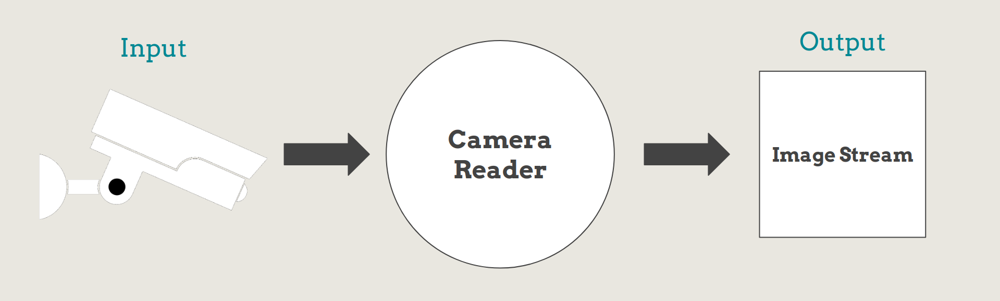
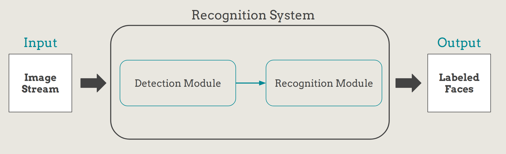

If you are at work or traveling, you are always worried about your house and kids. You tried to use security cameras but they are not very effective. You tried using smart cameras but they are very expensive. Don't worry **TinyEye** is here to solve your problem.

## Motivation
Traditional home security solutions are not very effective. Normal security cameras don't do much other than record too much video data that is very expensive to store and hard to analyze.
If you use smart cameras that do filter the data and provide alerts for important events then you will pay tons of money for the new hardware you will buy and the software that will process the videos and create the alerts.

## Solution
We provide a new system that utilizes the existing security cameras by using a single-board computer module that you connect to the camera and it does the trick for you.

This module will provide the following features:
1. Face Recognition
2. Activity Log
3. Notifications and Alerts

## System Architecture
As we have seen in the [previous section](#Solution "link to solution section") our system consists of three parts:
1. Camera
2. Controller (a single-board computer in our case we use a **Raspberry Pi 3 Model B+**)
3. Mobile Application
4. Server (to handle communication between different system modules)

The following diagram is an abstract diagram of our System Architecture

### Camera Reader
The following is an abstract diagram of the Camera Reader.

This module will be deployed on the controller. The camera will be connected to the controller through the ethernet port. This module is responsible for taking the camera video stream input process it and pass only frames that contain human faces to the next module.

### Recognition System
The following is an abstract diagram of the Recognition System.

This module will also be deployed on the controller. The Camera Reader module will pass frames that contain human faces. This module is responsible for processing the given frames and concludes who is the faces in the image (class_1, class_2, unknown, ...).

### Server
The following is an abstract diagram of the server.

This module will be deployed on the cloud. It's connected to the controller and the mobile application through the internet. It receives the recognition result from the Recognition System on the controller and constructs an activity log from it. It then proceeds to create notifications and alerts from the constructed log to send back to the mobile application. It also is responsible for training the models used for face recognition using the initial user settings provided by the mobile application. The resulting models would then be deployed on the controller.

### Mobile Application
The following is an abstract diagram of the mobile application.

This module would be deployed on the user smartphone. It connects to the server module through the internet. It's responsible for providing the activity log constructed by the server, the notifications, and alerts. It's also responsible for providing the user configuration to add new trusted faces. This achieved by taking photos of the face in different poses and angles as instructed by the application. The images are then sent to the server to train or update the recognition models.

## Repository Structure
This repository is divided into three main sub-projects which are the following:
1. [Recognition System](./Recognition%20System/README.md "Recognition System Project"): A C++ application to be deployed on the controller that contains [Reconition System Module](#Recognition%20System "Recognition System Section")
2. [Server](./Server/README.md "Server Project"): A Node.js server to implement [Server Module](#Server "Server Section")
3. [Mobile Application](./Mobile%20Application/README.md "Mobile Application Project"): A React Native mobile application to implement [Mobile Application Module](#Mobile%20Application "Mobile Application Section")

Every subproject contains its README for further instruction on how to build it and deploy it.
