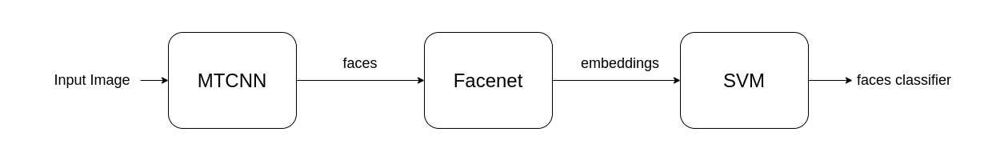
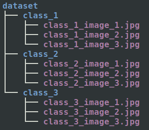

# TinyEye Server - Model Builder
Python Scripts to train a classifier for face recognition based on user setup images obtained from the mobile application

## Training
A simple script to train or update the classifier that will be uploaded to the controller.
The face recognition pipeline is as the following digram:



As we can see the pipeline for training is divided into three phases.
Before we go into explaining the pipeline, we should first explain what is the training set and how to represent it.

### Training Set
The training is should contain only photos of a single face. something like the following:


**note:** it doesn't have to contain just the face but it must be a single person face in the image.

You could as little as a single image for every class but this wouldn't yield very good results so it would be recommended to use 3 or more images to get decent accuracy. It's also recommended to use different poses and angles like a profile shoot.

The directory structure expected should be like the following directory tree:



**note:** the names of the subfolders would be used as the class names. for example, if you want classify **Barack Obama** you would need to change the name of the directory of that contain the photos to **Obama** instead of **class_1**.

### Face Detection - Phase 1
In this phase, we use MTCNN for face detection using the Keras implementation in the following repo: https://github.com/ipazc/mtcnn

You can easily get this implementation as a python package that you can simply install by following the **INSTALLATION** instruction provided on the repo page.

This phase is expected to take the input image and extract all the faces from it resize it to (1\*160\*160\*3) then pass it to the next phase

### Face To Embeddings - Phase 2
In this phase, we convert the face to a 128 embedding vector that represents the features of the face using Facenet Keras model that you can find in the following repo: https://github.com/davidsandberg/facenet

This step is very important because instead of trying to classify the images based on the pixels using maybe CNNs or any traditional Machine learning algorithm. We convert the faces into embeddings vector that is much easier to classify. The way that works is that Facenet is trained to differentiate between examples that contain the same face and examples that don't contain the same face.
Using this we get embedding vectors that are closer to each other in space if they are for the same person and further apart if they are for different people.

### SVM - Phase 3
After we have obtained the embeddings vectors, simply apply a classifier on them in our case we used a linear SVM classifier. The classifier is to be trained on the labeled embeddings vectors and the resulting model is saved and export as a binary file using **pickle** so it could be deployed anywhere using the same pipeline.

## Prediction
We implemented prediction for testing purposes because the actual target of this project is to run the pipeline on a single-board computer in our case we use a Raspberry Pi 3 Model B+.
Still, the concept is the same and it's much easier to test the performance and accuracy of the classifier in python.
Anyway, the only thing that changes in the case of prediction is that the SVM classifier would be used for prediction instead of training. The same first 2 phases in the pipeline have to be done for preprocessing.
The input image, however, can contain any number of faces. The result is also doesn't contain an unknown class so far so thresholding on class probability will be need.

## Run
We have to script one for training and the other one is for prediction train.py and predict.py respectively.

### Training Script
The training script has two modes:

1. Train mode: for training a new classifier from scratch
2. Add mode: for updating an existing classifier to add a new person

You can run the script by the following command for training:
```bash
python train.py -m train -fp [/path/to/facenet/h5/model/directory] -t [/path/to/training/images/directory] -e [/path/to/write/extracted/embedding/dataset] -s [/path/to/write/result/svm/classifier] -fn [name_of_facenet_h5_file]
```
For adding a new persion you can run the following command:
```bash
python train.py -m add -fp [/path/to/facenet/h5/model/directory] -e [/path/to/embedding/dataset/extracted/at/training] -s [/path/to/write/result/svm/classifier] -fn [name_of_facenet_h5_file] -a [path/to/new/person/images/directory]
```

To See default values and description of these command arguments run the following command:
```bash
python train.py --help
```

### Prediction Script
You can run the prediction script by the following command:
```bash
python predict.py -i [/path/to/input/image] -o [/path/to/write/output/image] -fp [/path/to/facenet/h5/model/directory] -e [/path/to/embedding/dataset/extracted/at/training] -s [/path/to/write/result/svm/classifier] -fn [name_of_facenet_h5_file]
```

To See default values and description of these command arguments run the following command:
```bash
python predict.py --help
```
